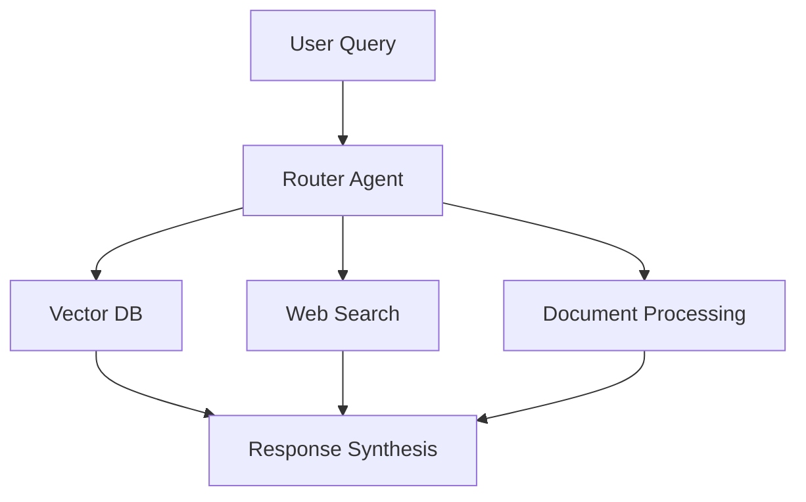

# Advanced AI Architectures: From Sequence Prediction to Multi-Agent RAG Systems

## Introduction

The landscape of artificial intelligence is rapidly evolving, with two key architectural paradigms emerging as fundamental building blocks for next-generation AI systems: sequence prediction architectures and multi-agent RAG (Retrieval-Augmented Generation) systems. In this comprehensive guide, we'll explore how these approaches complement each other and enable more sophisticated AI applications.

## Part 1: Sequence Prediction Architectures

### Understanding the Foundations

Modern AI systems rely heavily on different approaches to sequence prediction. Let's examine the four primary architectures:

1. **Left-to-right Autoregressive Prediction**
   ```python
   class AutoregressiveModel(nn.Module):
       def __init__(self, vocab_size, embedding_dim, hidden_dim):
           super().__init__()
           self.embedding = nn.Embedding(vocab_size, embedding_dim)
           self.lstm = nn.LSTM(embedding_dim, hidden_dim, batch_first=True)
           self.fc = nn.Linear(hidden_dim, vocab_size)
   ```
   - Used in: GPT models, traditional RNNs
   - Complexity: O(n) for generation
   - Key strength: Natural text generation

2. **Left-to-right Markov Chain**
   - Fixed context window approach
   - Excellent for real-time applications
   - Balances efficiency with context awareness

3. **Independent Prediction**
   - Maximum parallelization capability
   - Perfect for classification tasks
   - Context-free predictions

4. **Bidirectional Prediction**
   - Comprehensive context understanding
   - Powers models like BERT
   - Essential for deep language understanding

## Part 2: Multi-Agent RAG Systems

Building on sequence prediction foundations, modern RAG systems distribute specialized tasks across multiple agents:

### Core Components

1. **Retrieval Router Agent**
```python
class RetrievalRouterAgent:
    def __init__(self, llm):
        self.llm = llm
        self.memory = ConversationBufferMemory(memory_key="chat_history")
        
    def route_query(self, query: str) -> List[str]:
        sources = self.analyze_query_requirements(query)
        return self.distribute_tasks(sources)
```

2. **Specialized Retrieval Agents**
   - Vector DB Agent: Handles dense vector searches
   - Web Search Agent: Manages internet queries
   - Document Agent: Processes structured documents

### System Architecture



## Integration: Combining Sequence Prediction with RAG

The power of modern AI systems comes from integrating these architectures:

1. **Query Understanding**
   - Use bidirectional models for query analysis
   - Apply autoregressive prediction for query expansion
   - Leverage Markov chains for quick context assessment

2. **Information Retrieval**
   ```python
   class IntegratedRetrievalSystem:
       def __init__(self):
           self.sequence_model = AutoregressiveModel()
           self.rag_system = MultiAgentRAG()
           
       async def process_query(self, query: str):
           enhanced_query = self.sequence_model.enhance(query)
           results = await self.rag_system.retrieve(enhanced_query)
           return self.synthesize_response(results)
   ```

3. **Response Generation**
   - Combine retrieved information with sequence prediction
   - Use multi-agent coordination for coherent responses
   - Apply bidirectional understanding for context maintenance

## Best Practices and Implementation Tips

1. **Architecture Selection**
   - Choose sequence prediction type based on task requirements
   - Consider computational constraints
   - Balance accuracy vs. speed needs

2. **Agent Design**
   - Keep interfaces consistent
   - Implement robust error handling
   - Maintain clear documentation

3. **Performance Optimization**
   - Parallelize operations where possible
   - Implement efficient caching strategies
   - Monitor and optimize bottlenecks

## Practical Applications

1. **Enterprise Search**
   - Combine RAG with bidirectional prediction
   - Leverage specialized agents for different data sources
   - Maintain context across queries

2. **Content Generation**
   - Use autoregressive models for creative tasks
   - Augment with RAG for factual accuracy
   - Apply multi-agent coordination for complex topics

3. **Research and Analysis**
   - Integrate multiple information sources
   - Apply specialized agents for different domains
   - Maintain coherent context across documents

## Future Directions

The integration of sequence prediction architectures with multi-agent RAG systems opens exciting possibilities:

1. **Hybrid Architectures**
   - Combining different prediction types dynamically
   - Adaptive agent routing based on task requirements
   - Integrated memory systems across architectures

2. **Enhanced Reasoning**
   - Multi-step reasoning pipelines
   - Cross-agent knowledge sharing
   - Dynamic context management

## Conclusion

The combination of sequence prediction architectures and multi-agent RAG systems represents the cutting edge of AI system design. By understanding and effectively implementing these approaches, developers can create more powerful, efficient, and accurate AI applications.

## References

1. Vaswani, A., et al. (2017). "Attention Is All You Need." NeurIPS.
2. Brown, T., et al. (2020). "Language Models are Few-Shot Learners." NeurIPS.
3. Bengio, Y., et al. (2003). "Neural Probabilistic Language Models." JMLR.
4. Devlin, J., et al. (2019). "BERT: Pre-training of Deep Bidirectional Transformers." NAACL.
5. Radford, A., et al. (2018). "Improving Language Understanding by Generative Pre-Training." OpenAI.

---

*Author: Mohammed HAMDAN*  
*AIML - Step2wards Generative AI*

